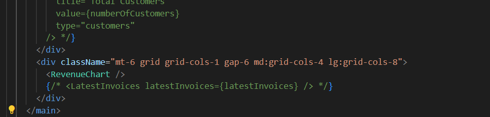

# Pemrograman Berbasis Framework - Pertemuan 9

## Introduction

I'm Maulidio Farhan Rizkullah with student ID 2141720041. I'm currently study in TI-3C class of State Polytechnic of Malang. With a passion for technology and a knack for problem-solving, I'm constantly seeking to expand my knowledge and skills in the field of programming.

## Table of Contents

- [Introduction](#introduction)
- [Table of Contents](#table-of-contents)
- [Author](#author)
- [Documentation](#documentation)
- [Contact Me](#contact-me)

## Author

- [@DioGitH](https://www.github.com/DioGitH)

## Documentation

### Praktikum 1
#### Langkah 1

#### Langkah 2
Membuat akun vercel

#### Langkah 3
Membuat project

#### Soal 1

Saya telah berhasil mendeploy project saya ke vercel

#### Langkah 4

#### Langkah 5

#### Soal 2

Saya telah mempelajari bagaimana cara membuat database dan menghubungkan dengan lokal dengan vercel

#### Langkah 6

#### Error

#### Soal 3

Saya telah berhasil melakukan seeder database, dan sekarang table tersebut dapat dilihat pada vercel milik saya

#### Langkah 7

#### Soal 4
Saya dapat query database langsung melalui vercel

- berikut contoh hasil query saya dimana saya memilih kolom nama dari table customers jika email customers tersebut adalah steph@dietz.com

### Praktikum 2

#### Langkah 1

#### Langkah 2

#### Langkah 3

#### Langkah 4

#### Langkah 5

#### Langkah 6

#### Soal 5

- [Hasil Deploy](https://09-nextjs-database-three.vercel.app/)

#### Langkah 7

#### Soal 6

data dari revenueFetch diubah ke data map dan selanjutnya baru ditampilkan di halaman page.tsx dengan <RevenueChart/>

#### Soal 7

pertama pada model query data diakses dengan function fetchLatesInvoices dan menambahkan limit 5 agar data yang diambil hanya 5, selanjutnya sama seperti revenueFetch, data diubah ke map dahulu setelah itu baru ditampilkan

### Tugas

#### Soal 1

#### Soal 2

Function fetchCardData digunakan untuk mengambil total data invoice dengan status paid atau pending dan customers yang selanjutnya hasil tersebut dijadikan data number yang akan direturn.

## Contact Me

